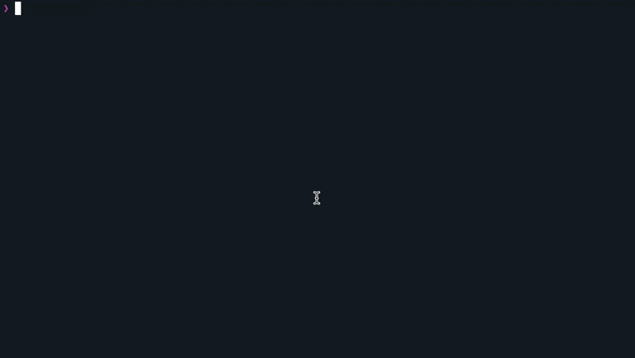

<div align="center">
  
</div>

# rig

A lightweight, tmux-based process manager for compose-like workflows without Docker. Built for speed and simplicity.

<div align="center">
  
</div>

## What it does

```bash
rig init      # Creates rig.yaml config
rig up        # Start all processes, stream logs (Ctrl+C stops all)
rig up -d     # Start in background (detached)
rig down      # Stop all processes
rig ps        # Show status
rig logs -f   # Follow logs
```

Processes run in tmux sessions - they survive terminal close and can be reattached.

## Install

**Prerequisites:** tmux and deno

```bash
# macOS
brew install tmux deno

# Linux
sudo apt install tmux
curl -fsSL https://deno.land/install.sh | sh
```

**Install rig:**

```bash
deno install -Agf -n rig https://raw.githubusercontent.com/roelentless/rig/develop/rig.ts
```

Ensure `~/.deno/bin` is in your PATH.

## Configuration

Create `rig.yaml` in your project:

```yaml
group: myapp

services:
  api:
    command: deno run -A server.ts
    working_dir: ./backend
    environment:
      PORT: 3000

  web:
    command: npm run dev
    working_dir: ./frontend
```

## Commands

```bash
rig init               # Create rig.yaml template
rig up                 # Start all (foreground, logs streaming)
rig up -d              # Start detached (background)
rig up api worker      # Start specific services
rig down               # Stop all
rig stop api           # Stop specific service
rig restart api        # Restart service
rig ps                 # Quick status
rig ps -f              # Status with memory/cpu/ports
rig top                # Live dashboard (q to exit)
rig logs               # Dump all logs
rig logs -f            # Follow all logs
rig logs api           # Logs for specific service
```

## How it works

tmux is the source of truth - no state files.

- Start: `tmux new-session -d -s {group}-{name} -c {working_dir} '{command}'`
- Stop: `tmux kill-session -t {group}-{name}`
- Status: `tmux list-sessions` filtered by group prefix

## Config reference

```yaml
group: myapp                    # Required. Prefix for tmux sessions

services:
  api:
    command: deno run -A app.ts  # Required. Command to run
    working_dir: ./backend       # Required. Working directory
    environment:                 # Optional. Environment variables
      PORT: 3000
      DEBUG: true
    color: cyan                  # Optional. Log color
```

Available colors: cyan, yellow, magenta, green, blue, orange, red, lavender, pink, teal, lime, coral, sky, gold, violet

## Uninstall

```bash
deno uninstall -g rig
```

## License

AGPL-3.0 - See LICENSE file.

---

Note: built to improve my personal workflow during development of [halebase.com](https://halebase.com) — don’t take it too seriously.

Generated with LLM assistance.
